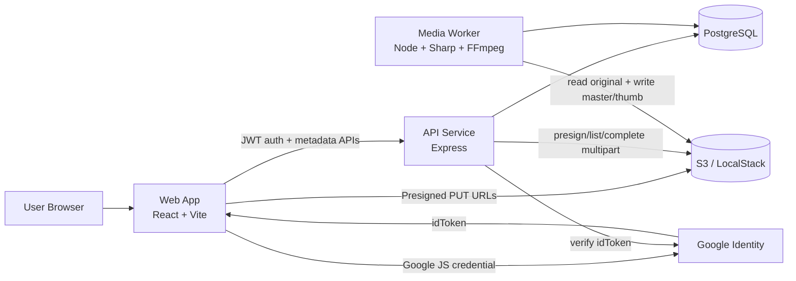
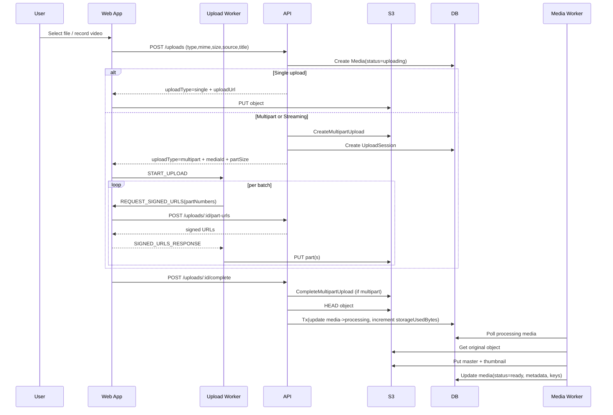
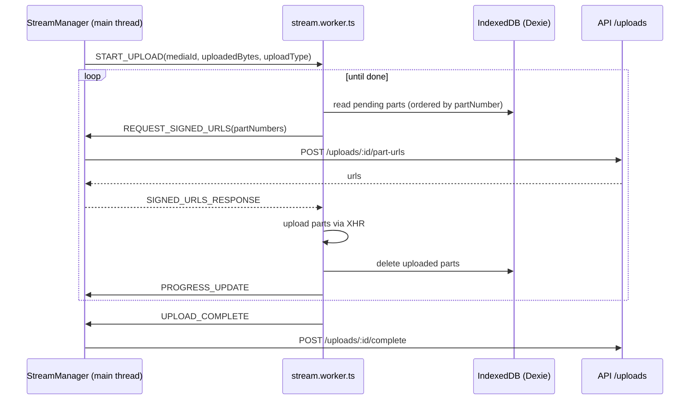
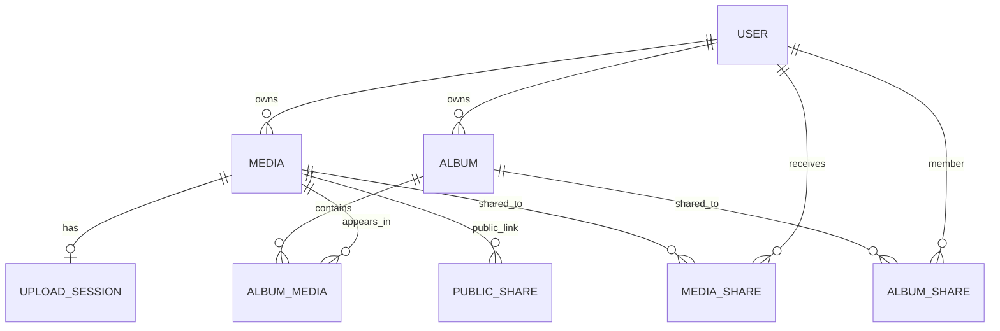
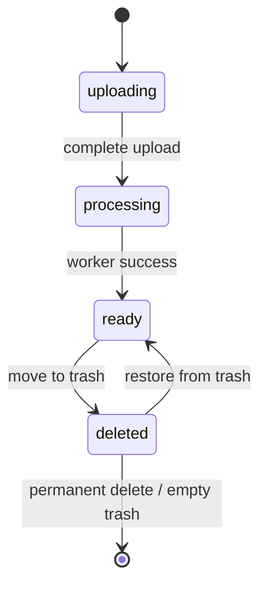

# Gallery System Architecture

Last reviewed: April 19, 2026

## 1) Purpose and Scope

This document describes the architecture of the Gallery monorepo in its current implementation.

It covers:

- Runtime services and shared packages
- Data model and ownership/access rules
- Upload and media-processing pipelines
- API surface and frontend integration patterns
- Infrastructure topology (local/dev)
- Suggested architecture diagrams you can render directly with Mermaid

## 2) Monorepo Structure

```text
gallery/
  apps/
    api/           Express API (auth, uploads, media, albums, user)
    web/           React + Vite frontend
    media-worker/  Background media processor (image/video)
    docs/          Project documentation
  packages/
    db/            Prisma client + schema + migrations
    s3/            Shared AWS S3 client factory
  docker-compose.yml
  localstack-init.sh
```

## 3) System Overview

Gallery is a multi-service media application with:

- `web` as the user-facing interface
- `api` as the control plane and authorization layer
- `media-worker` as the asynchronous processing plane
- PostgreSQL for metadata/state
- S3-compatible object storage for media binaries

Core design idea:

- Upload binaries directly from browser to S3 using presigned URLs
- Keep API mostly metadata/control oriented
- Process media asynchronously after upload completion

## 4) Runtime Components

## 4.1 Web App (`apps/web`)

Tech:

- React 19 + React Router 7
- Zustand stores (`authStore`, `mediaStore`, `albumStore`, `uploadStore`)
- Axios API client with bearer token interceptor
- Tailwind CSS
- Web Workers + Dexie (IndexedDB) for robust/resumable multipart and streaming uploads

Main responsibilities:

- Authentication UX (Google + email/password)
- Library browsing (gallery, images, videos, album scopes, shared scopes)
- Media viewer and sharing/public-link management
- Upload orchestration:
  - Single PUT upload path
  - Multipart file upload via dedicated worker
  - Streaming video capture with chunk persistence to IndexedDB + streaming worker upload

Key client architectural elements:

- `AppLayout` provides global navbar, sidebar, search query context, and upload FAB
- Route protection via `ProtectedRoute` + auth store state
- Normalized entities/cursor-query caches in Zustand
- Frontend pagination uses cursor-based APIs and infinite scroll

## 4.2 API Service (`apps/api`)

Tech:

- Express 5 + TypeScript
- Zod request validation middleware
- JWT auth middleware
- Prisma client from shared `@gallery/db`
- S3 client from shared `@gallery/s3`

Middleware pipeline:

- CORS configured with `FRONTEND_URL`
- JSON parsing
- Route-level validation and auth
- Async handler wrapper
- Centralized error middleware

Module boundaries:

- `auth`: Google token login, credentials login, current user (`/auth/me`)
- `uploads`: upload session lifecycle + presigned URLs + completion/abort/status
- `media`: library, trash, details, direct sharing, public links, public retrieval
- `albums`: album CRUD, album media membership, collaborator roles
- `user`: account info + password auth toggling

Important behavior:

- On startup, API verifies DB connectivity and S3 reachability before listening
- Upload completion triggers media status transition to `processing`; worker later marks `ready`

## 4.3 Media Worker (`apps/media-worker`)

Tech:

- Node + TypeScript
- Sharp (image processing)
- FFmpeg (video transcoding, thumbnail extraction)
- Prisma + S3 clients from shared packages

Execution model:

- Infinite loop polling `media.status = processing` in batches (`take: 5`)
- Dispatch by media type:
  - Images: normalize/compress to JPEG + thumbnail
  - Videos: transcode to MP4 + thumbnail + metadata extraction
- Update media DB row with derived keys/metadata and set `status = ready`

## 4.4 Shared Packages

`@gallery/db`:

- Central Prisma client factory using `@prisma/adapter-pg`
- Exposes generated Prisma client/types
- Hosts schema and migrations

`@gallery/s3`:

- Central S3 client factory
- Supports endpoint override + path-style mode (for LocalStack compatibility)
- Exposes S3 SDK commands + presigner helper

## 5) Data Architecture

Primary entities:

- `User`: identity, auth settings, quota and storage usage
- `Media`: canonical media item + lifecycle + storage keys + metadata
- `UploadSession`: multipart upload tracking and expiry
- `Album`: owned media collections with optional cover media
- `AlbumMedia`: album-to-media membership join table
- `AlbumShare`: collaborator mapping + role (`viewer`/`editor`)
- `MediaShare`: direct media share to specific user
- `PublicShare`: tokenized public link with optional expiry

Ownership/access principles:

- Media ownership is strict (`ownerId`)
- Direct share grants per-media read access (`MediaShare`)
- Album share grants access to album and contained media (for that album scope)
- Public links bypass auth but require valid, non-expired token

Lifecycle:

- `Media.status`: `uploading` -> `processing` -> `ready` -> `deleted` (soft delete)
- Hard delete from trash removes DB rows and S3 objects; decrements `storageUsedBytes`

## 6) Upload and Processing Pipelines

## 6.1 Upload Modes

Single upload:

- Used for smaller file uploads (`<= 10MB`) with source `file`
- API returns one presigned `PUT` URL
- Browser uploads directly and calls `complete`

Multipart upload:

- Used for larger file uploads (`> 10MB`) and all streaming uploads
- API creates S3 multipart upload and DB `UploadSession`
- Browser worker requests part URL batches, uploads parts, then API completes upload

Streaming upload:

- Video capture chunks from `MediaRecorder` are buffered to IndexedDB
- Stream worker drains stored parts, requests presigned URLs via main thread, uploads concurrently
- Supports durability/resume from local persisted chunks + backend uploaded-part status

## 6.2 Completion and Processing

- API `completeUploadService`:
  - Completes multipart if applicable
  - Verifies S3 object existence/size
  - Re-checks quota with actual object size
  - Atomically:
    - sets `media.status = processing`
    - increments `user.storageUsedBytes`
- Worker picks up `processing` media and writes:
  - `masterKey`
  - `thumbnailKey`
  - dimensions/duration/mime normalization
  - `status = ready`

## 7) API Surface (High-Level)

Authentication:

- `POST /auth/google`
- `POST /auth/credentials-login`
- `GET /auth/me`

Uploads:

- `POST /uploads`
- `POST /uploads/:id/part-urls`
- `POST /uploads/:id/complete`
- `GET /uploads/:id/status`
- `GET /uploads`
- `DELETE /uploads/:id`

Media:

- `GET /media`
- `GET /media/:mediaId`
- `PATCH /media/:mediaId`
- `DELETE /media`
- `GET /media/trash`
- `POST /media/trash/restore`
- `DELETE /media/trash`
- `DELETE /media/trash/all`
- `GET /media/shares/received`
- `GET /media/shares/sent`
- `GET /media/shares/public`
- `GET /media/:mediaId/shares`
- `POST /media/:mediaId/shares`
- `DELETE /media/:mediaId/shares/:targetUserId`
- `GET /media/:mediaId/shares/public`
- `POST /media/:mediaId/shares/public`
- `DELETE /media/shares/public`
- `GET /public/:token` (no auth)

Albums:

- `POST /albums`
- `GET /albums`
- `GET /albums/:albumId`
- `PATCH /albums/:albumId`
- `DELETE /albums/:albumId`
- `POST /albums/:albumId/media`
- `DELETE /albums/:albumId/media`
- `GET /albums/:albumId/shares`
- `POST /albums/:albumId/shares`
- `PATCH /albums/:albumId/shares/:targetUserId`
- `DELETE /albums/:albumId/shares/:targetUserId`
- `POST /albums/:albumId/leave`

User:

- `GET /user`
- `POST /user/update-password-auth-state`

System:

- `GET /health`

## 8) Infra and Deployment Topology (Current)

Local stack (`docker-compose.yml`):

- PostgreSQL 16
- LocalStack (S3 service)
- Optional one-shot DB migrate container

S3 bootstrap:

- `localstack-init.sh` creates `gallery-bucket`
- Applies permissive CORS (all origins/methods, exposes `ETag`)

Environment-driven runtime:

- API/worker require DB + S3 credentials and bucket
- API requires JWT secret
- Google auth requires client ID (and frontend JS integration)

## 9) Suggested Architecture Diagrams

The following Mermaid diagrams are suggested as the default architecture pack for this project.

## 9.1 System Context / Container Diagram



## 9.2 Upload Sequence Diagram



## 9.3 Streaming Worker Handshake (Frontend)



## 9.4 Media Domain ER Diagram



## 9.5 Media Lifecycle State Diagram



## 10) Cross-Cutting Architectural Decisions

Direct-to-S3 uploads:

- Pros: offloads binary traffic from API, scales better
- Trade-off: requires robust client-side orchestration and resumability logic

Polling worker model:

- Pros: simple implementation, minimal infrastructure dependencies
- Trade-off: higher idle polling overhead and slower reaction than queue/event-driven workers

Role model:

- Album sharing supports role-based editing (`viewer`/`editor`)
- Direct media sharing is currently view access only

Cursor pagination:

- Uses `(time,id)` base64url cursors for stable pagination in high-write datasets

## 11) Observed Gaps / Risks (Current Implementation)

- Worker polling is infinite-loop based and not queue-backed
- Cleanup jobs for stale/expired upload sessions are TODOs (not active)
- Storage operations and DB writes are not globally atomic across systems (S3 + DB consistency windows are possible)
- JWT token is stored in `localStorage` (XSS-sensitive vs httpOnly cookie model)
- `streaming` part records in Dexie currently use placeholder `userId: "currentUserId"` (not tied to authenticated user id)
- `/favorites` route exists in UI navigation but no dedicated backend favorite domain model currently

## 12) Recommended Evolution Path

Near-term:

- Add scheduled cleanup jobs for expired `UploadSession` and stale `uploading` media
- Add retry/backoff/dead-letter semantics for media processing failures
- Add structured observability (request IDs, metrics for upload completion and processing latency)

Mid-term:

- Move processing trigger from polling to event/queue model (S3 event -> queue -> worker)
- Add idempotency keys around upload completion and processing updates
- Introduce explicit `failed` media status for processing/upload terminal failures

Security hardening:

- Consider rotating to secure cookie auth for browser sessions
- Add stricter CORS and explicit allowed origins per environment
