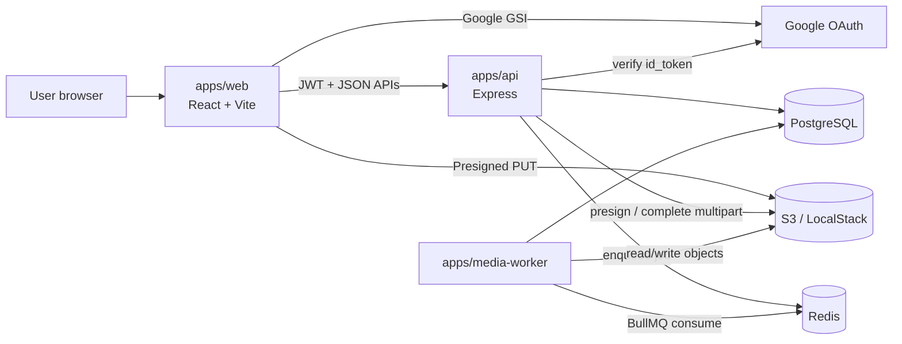
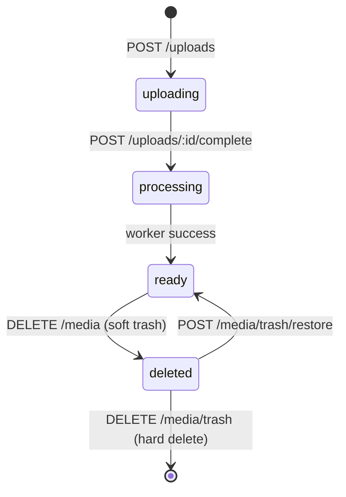
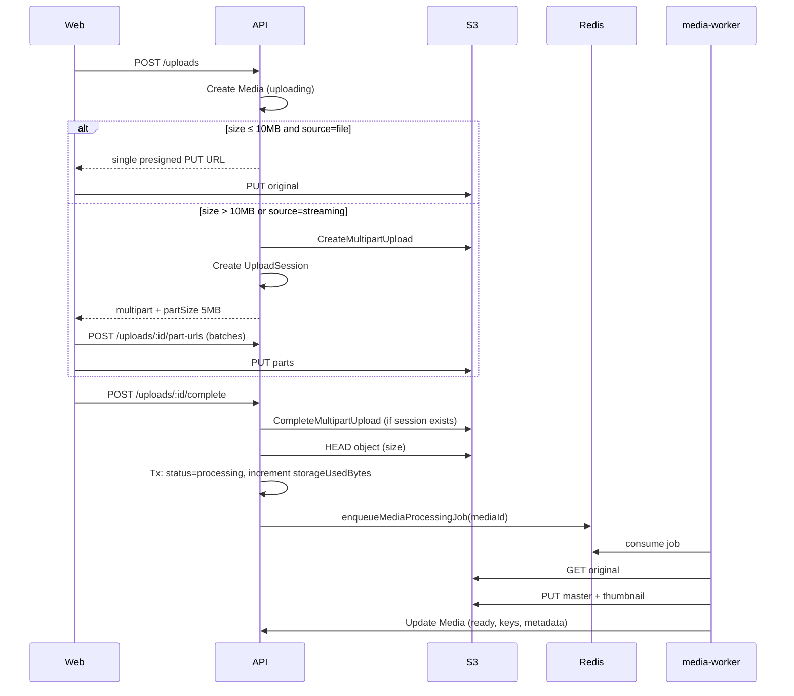

# System Architecture

Last reviewed against codebase: June 2026.

## Purpose

Gallery is a self-hosted photo/video library. Users authenticate, upload media directly to S3-compatible storage, and browse albums and shared content. Uploaded files are processed asynchronously into optimized masters and thumbnails.

## High-level design


```mermaid
flowchart LR
  Browser[User browser]
  Web[apps/web<br/>React + Vite]
  API[apps/api<br/>Express]
  Worker[apps/media-worker]
  Redis[(Redis)]
  DB[(PostgreSQL)]
  S3[(S3 / LocalStack)]
  Google[Google OAuth]

  Browser --> Web
  Web -->|JWT + JSON APIs| API
  Web -->|Presigned PUT| S3
  Web -->|Google GSI| Google
  API -->|verify id_token| Google
  API --> DB
  API -->|presign / complete multipart| S3
  API -->|enqueue job| Redis
  Worker -->|BullMQ consume| Redis
  Worker --> DB
  Worker -->|read/write objects| S3
```


**Control plane vs data plane**

- **API** — Auth, metadata, presigned URLs, sharing, quotas. Does not proxy file bytes in normal upload flow.
- **Web** — UI, upload orchestration (including Web Workers + IndexedDB for resumable uploads).
- **Media worker** — CPU-heavy transforms (Sharp, FFmpeg) after upload completes.
- **PostgreSQL** — Users, media metadata, albums, shares, upload sessions.
- **S3** — `original`, `master`, and `thumbnail` objects per media item.
- **Redis + BullMQ** — Queue between API (producer) and media worker (consumer).

## Monorepo structure

```text
gallery/
  apps/
    api/              Express 5 + TypeScript
    web/              React 19 + Vite 7
    media-worker/     Node worker (Sharp, fluent-ffmpeg)
    docs/             Developer documentation
  packages/
    db/               Prisma 7 + PostgreSQL adapter
    s3/               Shared S3Client factory
    queue/            BullMQ queue + worker helpers
  docker-compose.yml
  localstack-init.sh
  .env                Shared dev configuration
```

## Request lifecycle (authenticated API)

1. Browser sends `Authorization: Bearer <JWT>`.
2. `authMiddleware` (`apps/api/src/middlewares/auth.middleware.ts`) verifies token with `JWT_SECRET` and sets `req.user = { id, email }`.
3. Route handler runs after optional Zod `validate` middleware.
4. Errors propagate to `errorMiddleware` → JSON `{ success: false, message }`.

Public exception: `GET /public/:token` has no auth middleware (public share token).

## Media lifecycle


```mermaid
stateDiagram-v2
  [*] --> uploading: POST /uploads
  uploading --> processing: POST /uploads/:id/complete
  processing --> ready: worker success
  ready --> deleted: DELETE /media (soft trash)
  deleted --> ready: POST /media/trash/restore
  deleted --> [*]: DELETE /media/trash (hard delete)
```


| Status       | Meaning                                        |
| ------------ | ---------------------------------------------- |
| `uploading`  | `Media` row created; client uploading to S3    |
| `processing` | Upload complete; job queued / worker running   |
| `ready`      | Master + thumbnail written; visible in library |
| `deleted`    | Soft-deleted (`deletedAt` set)                 |


There is no `failed` status in the schema today. If BullMQ exhausts retries, the row can remain stuck in `processing`.

## Upload → process sequence


```mermaid
sequenceDiagram
  participant W as Web
  participant A as API
  participant S as S3
  participant R as Redis
  participant MW as media-worker

  W->>A: POST /uploads
  A->>A: Create Media (uploading)
  alt size ≤ 10MB and source=file
    A-->>W: single presigned PUT URL
    W->>S: PUT original
  else size > 10MB or source=streaming
    A->>S: CreateMultipartUpload
    A->>A: Create UploadSession
    A-->>W: multipart + partSize 5MB
    W->>A: POST /uploads/:id/part-urls (batches)
    W->>S: PUT parts
  end
  W->>A: POST /uploads/:id/complete
  A->>S: CompleteMultipartUpload (if session exists)
  A->>S: HEAD object (size)
  A->>A: Tx: status=processing, increment storageUsedBytes
  A->>R: enqueueMediaProcessingJob(mediaId)
  MW->>R: consume job
  MW->>S: GET original
  MW->>S: PUT master + thumbnail
  MW->>A: Update Media (ready, keys, metadata)
```


## Processing trigger (current)


| Approach | Status |
| -------- | ------ |
| Redis + BullMQ (`@gallery/queue`) | API calls `enqueueMediaProcessingJob` after complete upload |
| DB polling loop | Removed — replaced by BullMQ |


Worker startup still **re-enqueues** any rows left in `processing` (crash recovery).

## Access control model


| Mechanism     | Scope                                                |
| ------------- | ---------------------------------------------------- |
| Ownership     | `Media.ownerId` — full control for owner             |
| `MediaShare`  | Direct share to another user (read via shared lists) |
| `AlbumShare`  | Album-level access with role `viewer` or `editor`    |
| `PublicShare` | Token URL `GET /public/:token` (no JWT)              |


Album editors can add/remove media in shared albums (see albums service); direct media shares do not expose edit roles in the schema.

## Cross-cutting decisions

**Direct-to-S3 uploads** — Reduces API bandwidth; client must handle multipart, retries, and resume.

**JWT in localStorage** — Simple SPA auth; vulnerable to XSS compared to httpOnly cookies.

**Cursor pagination** — Stable ordering with `(createdAt DESC, id DESC)` and encoded cursor (`apps/api/src/utils/paginationCursor.ts`).

**BigInt JSON** — API registers `BigInt.prototype.toJSON` in `app.ts` so `storageUsedBytes` serializes as string.

## Known gaps

- `**/favorites` route** — Registered in `apps/web/src/app/router.tsx` and sidebar; uses same `Gallery` component as `/gallery` with no favorite filter; no `Favorite` model in Prisma.
- **Processing failures** — No terminal `failed` status; failed jobs log to worker stderr after 3 BullMQ attempts.
- **Upload session cleanup** — `UploadSession.expiresAt` is set (3 days) but no cron deletes stale sessions or `uploading` media.
- **Streaming IndexedDB** — `Part.userId` can be placeholder `"currentUserId"` in stream upload path (see web upload docs).
- **S3 + DB consistency** — Complete upload updates DB after S3 verify; worker updates DB after S3 writes — not a single distributed transaction.

## Related docs

- [Getting started](./getting-started.md)
- [API reference](../04-api/README.md)
- [Upload pipeline](../05-web/upload-pipeline.md)
- [Media worker](../06-media-worker/README.md)
- [Data model](../07-data-model/schema.md)

