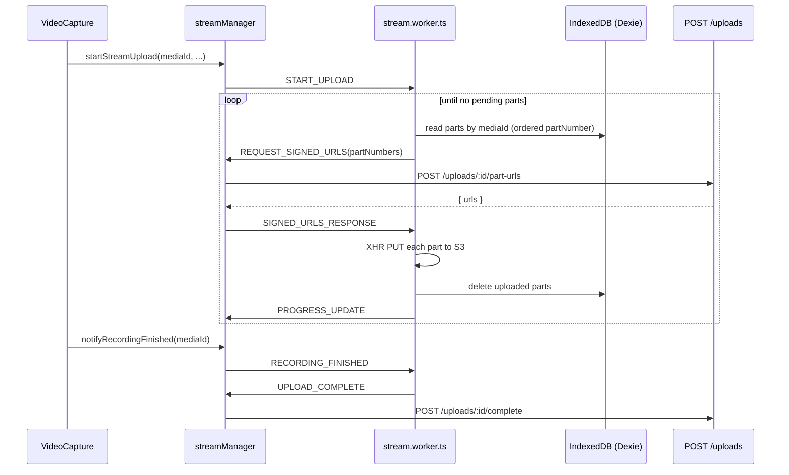

# Stream Worker Handshake

Detailed message flow between `streamManager.ts` (main thread) and `stream.worker.ts`.

## Diagram

## Why main thread calls the API

Web Workers cannot access `localStorage` for the JWT. The worker requests URLs; the manager attaches `Authorization` and calls Axios.

## Failure handling

- XHR upload failures retry within worker logic (see `stream.worker.ts` for per-part retry limits)
- `STOP_UPLOAD` aborts in-flight work
- Manager can `terminate()` worker and clear IndexedDB on user cancel

## Files

| File | Role |
|------|------|
| `lib/uploads/streamManager.ts` | Worker lifecycle, API bridge |
| `lib/uploads/stream.worker.ts` | Upload loop, IndexedDB IO |
| `lib/db.ts` | Dexie schema |
| `components/uploads/VideoCapture.tsx` | MediaRecorder integration |

See also [upload pipeline](./upload-pipeline.md).
