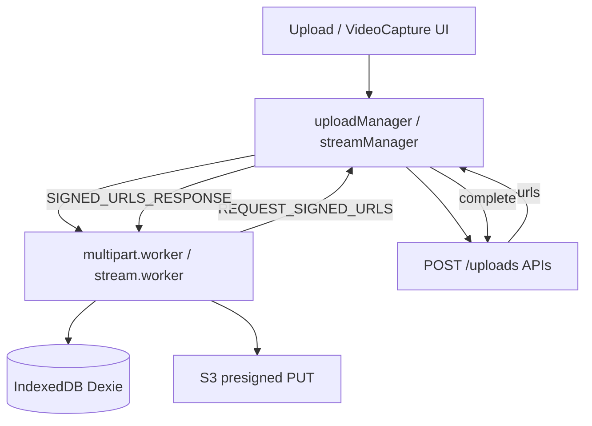

# Web Upload Pipeline

How the browser uploads files without sending bytes through the API.

## Overview

## Entry points

| Component | Path | Upload type |
|-----------|------|-------------|
| `Upload.tsx` | File input | Single or multipart via `uploadManager` |
| `VideoCapture.tsx` | `MediaRecorder` | Streaming multipart via `streamManager` |
| `singleUpload.ts` | Small files | Direct XHR PUT to presigned URL |
| `useUpload.ts` | Hook | Coordinates store + managers |

## Server contract

1. `POST /uploads` — returns `{ uploadType, mediaId, ... }`
2. If multipart: repeated `POST /uploads/:mediaId/part-urls` with `{ partNumbers: number[] }`
3. `POST /uploads/:mediaId/complete` — triggers `processing` + BullMQ job

Constants (API-side, `uploads.service.ts`):

| Constant | Value |
|----------|-------|
| Multipart threshold | 10 MB |
| Part size | 5 MB |
| Session expiry | 3 days |

## Single upload (`uploadType: "single"`)

`singleUpload.ts`:

1. `uploadStore` marks item uploading
2. `XMLHttpRequest` PUT to `uploadUrl`
3. On success → `completeUpload(mediaId)`

## Multipart file upload

`uploadManager.ts` spawns `multipart.worker.ts`:

| Message | Direction | Purpose |
|---------|-----------|---------|
| `START_UPLOAD` | Main → Worker | `mediaId`, `partSize`, auth token |
| `REQUEST_SIGNED_URLS` | Worker → Main | Batch of part numbers |
| `SIGNED_URLS_RESPONSE` | Main → Worker | Presigned URLs from API |
| `PROGRESS_UPDATE` | Worker → Main | Bytes uploaded |
| `UPLOAD_COMPLETE` | Worker → Main | All parts done |
| `ABORT_UPLOAD` | Main → Worker | Cancel |

Worker uploads parts concurrently (pool of async workers inside `multipart.worker.ts`), then main thread calls complete.

## Streaming video upload

`streamManager.ts` + `stream.worker.ts` + Dexie DB `VideoUploader` (`lib/db.ts`):

1. `VideoCapture` records chunks → stored as `Part` rows in IndexedDB (`mediaId`, `partNumber`, `blob`)
2. `stream.worker` reads pending parts, requests signed URLs via main thread (same message pattern as multipart)
3. After upload, parts deleted from IndexedDB
4. `RECORDING_FINISHED` message when capture ends
5. Main calls `completeUpload`

**Note:** Some `Part` records use `userId: "currentUserId"` placeholder (not the real auth user id) — see stream worker implementation when debugging multi-user devices.

## Upload store

`uploadStore.ts` tracks per-`mediaId`:

- `status`: `pending` | `uploading` | `streaming` | `failed`
- Progress percentage
- Merges with `GET /uploads` for resume UI

## Resume

`GET /uploads/:id/status` returns already-uploaded part numbers from S3 (`ListParts`). Client uses this to skip completed parts (multipart flows).

## IndexedDB schema

`lib/db.ts` — Dexie database `VideoUploader`, table `parts`:

- Index `[mediaId+partNumber]`
- Fields: `userId`, `mediaId`, `partNumber`, `blob`, `createdAt`

## Related

- [Stream worker diagram](./stream-worker.md)
- [API uploads module](../04-api/README.md#uploads--uploads)
