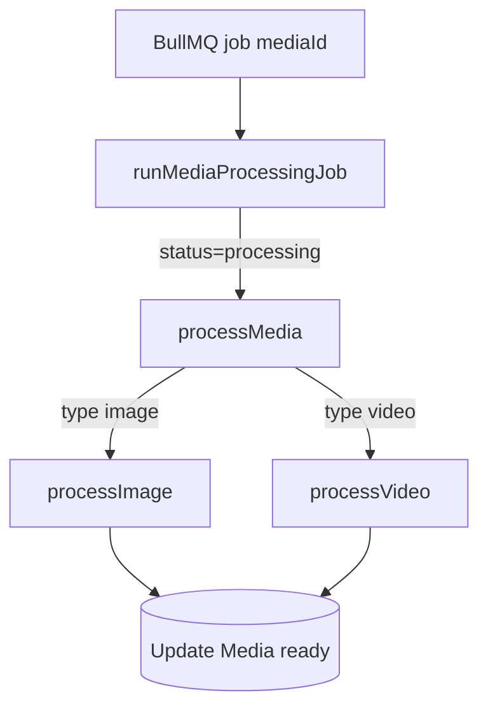

# Media Worker

**Path:** `apps/media-worker`  
**Role:** Consume BullMQ jobs and transform uploaded originals into masters + thumbnails.

## Startup (`src/index.ts`)

1. Log concurrency from `getMediaWorkerConcurrency()` (env `MEDIA_WORKER_CONCURRENCY`, default **5**)
2. **Backlog drain** — query `Media` where `status = processing`, enqueue each id via `enqueueMediaProcessingJob` (crash recovery)
3. `createMediaProcessingWorker(processor)` from `@gallery/queue`
4. On `SIGINT` / `SIGTERM`: close worker + `closeMediaProcessingQueue()`

## Job processing flow

### `processMediaJob.ts`

Loads media by id; **no-op** if missing or status ≠ `processing`.

### `processMedia.ts`

Dispatches on `media.type`:

- `image` → `processors/image.processor.ts`
- `video` → `processors/video.processor.ts`
- else throws (caught, rethrown for BullMQ retry)

## Image processing

`processors/image.processor.ts`:

1. `getObject(originalKey)` from S3
2. Sharp: auto-rotate, JPEG master (quality 82, mozjpeg)
3. Sharp: thumbnail max width 300px, JPEG quality 75
4. Upload `master.jpg`, `thumbnail.jpg`
5. Prisma update: `masterKey`, `thumbnailKey`, `width`, `height`, `mimeType: image/jpeg`, `status: ready`

## Video processing

`processors/video.processor.ts`:

1. Download original to `/tmp/{id}-input`
2. FFmpeg → H.264/AAC MP4 (`master.mp4`) with `+faststart`
3. FFmpeg screenshot → thumbnail JPEG
4. Probe metadata (width, height, duration) from output file
5. Upload to S3; update DB (`mimeType: video/mp4`, `durationSeconds`, etc.)
6. `finally` block deletes temp files

**Host requirement:** `ffmpeg` binary available on PATH for `fluent-ffmpeg`.

## Dependencies

| Package | Use |
|---------|-----|
| `@gallery/db` | Prisma client |
| `@gallery/s3` | Object get/put |
| `@gallery/queue` | BullMQ worker |
| `sharp` | Images |
| `fluent-ffmpeg` | Video |

Env: same root `.env` as API (`DATABASE_URL`, `REDIS_URL`, S3 vars).

## Retries and failures

BullMQ job options (in `@gallery/queue`):

- 3 attempts, exponential backoff starting 5s
- On final failure: job retained in failed set (`removeOnFail: 100`)
- **Media row is not updated** to a failure state — can remain `processing`

## Scaling

| Mode | How |
|------|-----|
| More parallel jobs | `MEDIA_WORKER_CONCURRENCY=10` |
| More throughput | Multiple worker processes on different hosts, same `REDIS_URL` |

## Related

- [Queue package](../03-packages/queue.md)
- [S3 keys](../07-data-model/schema.md#s3-object-keys)
- [Upload complete flow](../01-overview/system-architecture.md#upload--process-sequence)
