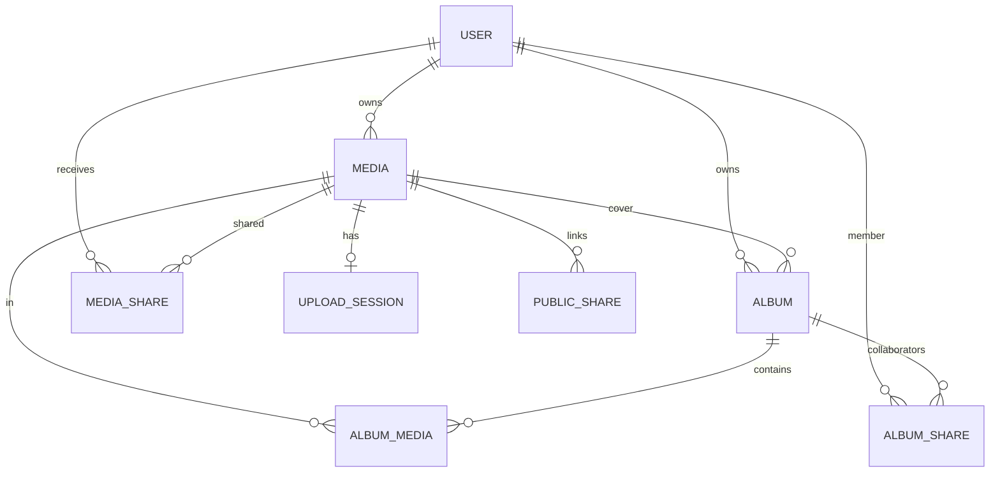

# Data Model

Source of truth: `packages/db/prisma/schema.prisma`

## Entity relationship



## User

| Field | Type | Notes |
|-------|------|-------|
| `id` | UUID | PK |
| `email` | String | Unique |
| `passwordAuthEnabled` | Boolean | Default `false` |
| `passwordHash` | String? | bcrypt |
| `storageUsedBytes` | BigInt | Incremented on upload complete |
| `storageQuotaBytes` | BigInt | Default `10737418240` (10 GiB) |
| `avatarUrl` | String? | From Google or manual |

## Media

| Field | Type | Notes |
|-------|------|-------|
| `type` | `image` \| `video` | |
| `status` | enum | See lifecycle below |
| `originalKey` | String | S3 key at create |
| `masterKey` | String? | Set by worker |
| `thumbnailKey` | String? | Set by worker |
| `sizeBytes` | BigInt? | Set at upload complete |
| `width`, `height` | Int? | From processing |
| `durationSeconds` | Int? | Video only |
| `title` | String | User-facing |
| `deletedAt` | DateTime? | Soft delete |
| `takenAt` | DateTime? | Optional EXIF/time |

### MediaStatus

| Value | When |
|-------|------|
| `uploading` | Row created at `POST /uploads` |
| `processing` | After `POST /uploads/:id/complete` |
| `ready` | Worker finished |
| `deleted` | Moved to trash |

### Indexes

- `[ownerId, status, createdAt DESC]` — library queries
- Partial index on `[ownerId, deletedAt DESC, id]` where `deletedAt IS NOT NULL` — trash

## UploadSession

Tracks S3 multipart upload for one `Media`.

| Field | Notes |
|-------|-------|
| `s3UploadId` | AWS multipart upload id |
| `source` | `file` or `streaming` |
| `expiresAt` | Now + 3 days at creation |
| `mediaId` | Unique 1:1 with Media |

Deleted when upload completes successfully.

## Album / AlbumMedia

- **Album** — owned by `ownerId`; optional `coverMediaId`
- **AlbumMedia** — composite PK `(albumId, mediaId)`

## AlbumShare

| Field | Notes |
|-------|-------|
| `role` | `viewer` or `editor` |
| Unique `(albumId, userId)` | |

## MediaShare

Direct user-to-user share for one media item. Unique `(mediaId, userId)`.

## PublicShare

| Field | Notes |
|-------|-------|
| `token` | Unique string for `/public/:token` |
| `expiresAt` | Optional |

## S3 object keys

Convention from `uploads.service.ts` and processors:

```text
users/{ownerId}/{mediaId}/original      # uploaded bytes (any extension/mime)
users/{ownerId}/{mediaId}/master.jpg    # processed image
users/{ownerId}/{mediaId}/master.mp4    # processed video
users/{ownerId}/{mediaId}/thumbnail.jpg # preview image
```

## Storage accounting

- **Quota check** at `POST /uploads` if `sizeBytes` known
- **Final quota check** at complete using S3 `HeadObject` size
- **Increment** `storageUsedBytes` in same transaction as `status → processing`
- **Decrement** on permanent trash delete (media service)

## Migrations

Located in `packages/db/prisma/migrations/`. Apply with `pnpm db:migrate` or Docker `db-migrate` service.

Do not rename or edit applied migrations; add new folders for schema changes.

## Related

- [Prisma package](../03-packages/db.md)
- [API media routes](../04-api/README.md#media--media)
